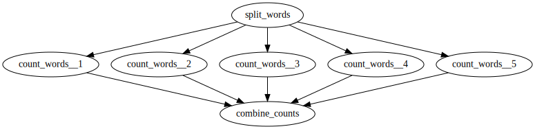

# Basic Diamond

In this example, our goal is to answer the following question:

> How many of the words in `words.txt` are less than five letters long?

Problems like this are pleasantly parallel, because we can analyze each word
(or arbitrary group of words) without reference to any other words.

Although there are only a few hundred thousand words in `words.txt`, we will
write a DAG to perform the above analysis as an exercise.
Our code will be in two main pieces:

1. The Python script `make_dag.py`, which we will run locally to create the DAG
   specification that HTCondor will use to execute the DAG.
1. The Python scripts `split_words.py`, `count_words.py`, and `combine_counts.py`.
   1. `split_words.py` will divide `words.txt` into smaller chunks.
   1. `count_words.py` will count the number of words less than five letters
      long in whatever input it is given.
   1. `combine_counts.py` will combine all of the counts from individual runs of
      `count_words.py` into a single count.

The overall workflow looks like this:

The arrows describe parent -> child relationships.
The job (or "node", in DAG parlance) at the start of the arrow must complete
before the job at the end of the arrow can start.

We often refer to this basic structure as a "diamond" or as a "scatter-gather".
It is also an example of a "map-reduce" workflow, where you have one function to
run on each piece of data (the "map"), and another function that runs on the results
of the map to combine them in some way (the "reduce").

Don't worry if you're not familiar with text processing in Python.
All of the scripts in the second group are written as simply as possible.
The most important thing to focus on is `make_dag.py`: the other scripts simply
exist to make sure this example is actually runnable.
Each file contains comments explaining what it does, so your next step should
be to read through `make_dag.py` itself.

## Running the Example

1. Run `python make_dag.py`, which should create a `dagfile.dag` as
   well as a bunch of `*.sub` files in this directory.
1. Run `condor_submit_dag dagfile.dag`.

If everything goes well, you should end up with a file named `total_counts.txt`
containing the number `2582`.
