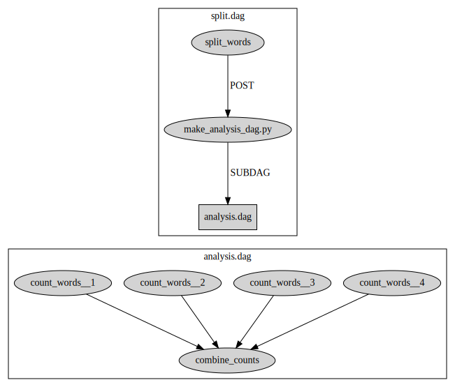

# Delayed Diamond

**Look through the Basic Diamond example first! This example expands on that one!**

In this example, we have to solve the same basic problem as the Basic Diamond
example:

> How many of the words in `words.txt` are less than five letters long?

However, we now have an additional restriction:

> The number of chunks is not known ahead of time; it is determined during the
> execution of `split_words.py`.

This will necessarily change the structure of our workflow. In the Basic Diamond
example, the `count_words` layer looked like this:

```python
count_words = split_words.child_layer(
    name="count_words",
    submit_description=Submit(
        {
            "executable": "count_words.py",
            "arguments": "$(word_set)",
            "transfer_input_files": "words_$(word_set).txt",
            "output": "count_words_$(word_set).out",
            "error": "count_words_$(word_set).err",
        }
    ),
    vars=[{"word_set": str(n)} for n in range(NUM_CHUNKS)],
)
```
We can see that it depends on `NUM_CHUNKS` being known ahead of time.
Since we no longer know `NUM_CHUNKS` ahead of time, we will need to be more
clever.

The trick is to delay the construction of this layer until later in the workflow,
when we know how many chunks `words.txt` was split into.
To do this, we need to use a **SubDAG**, which is a node in our DAG
that behaves like a self-contained DAG.
The top-level DAG will perform the split, then create a second DAG, then run
that second DAG.
Because we create the second DAG after the split has already occurred, we can
figure out how many chunks were created.

The overall workflow now looks like this:



Unlike a layer, which needs to be defined up-front, a `SubDAG` just needs to know
where the DAG input file for itself exists.
That DAG input file needs to exist when the `SubDAG` node **executes**, but not
when it is merely **defined**.

To build this workflow, we need to split the original `make_dag.py` script
that created it into two scripts: `make_top_dag.py` and `make_analysis_dag.py`.
The first creates the top-level DAG which performs the split, then runs
`make_analysis_dag.py`, and finally run the sub-DAG.
We won't run `make_analysis_dag.py` ourselves.
Instead, we set up the `split_words` layer to run it as a post-script.
Look at `make_top_dag.py` and `make_analysis_dag.py` to see the changes in detail.

Conveniently, we don't need to change `count_words.py` or `combine_counts.py`
at all; we just need to change how we determine their input files.
The only change to `split_words.py` is to make it choose the number of chunks
randomly (either 5, 10, or 20):
```python
import random

num_chunks = random.choice((5, 10, 20))
```

## Running the Example

1. Run `python make_top_dag.py`, which should create a `top_level.dag` as
   well as a bunch of `*.sub` files in this directory.
1. Run `condor_submit_dag top_level.dag`.

The sub-DAG will be created and executed as part of the execution of `top_level.dag`.
You should see either 5, 10, or 20 `words_<n>.txt` files created after the first step.

If everything goes well, you should end up with a file named `total_counts.txt`
containing the number `2582`.
